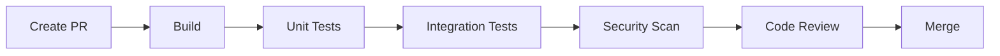
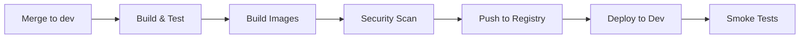
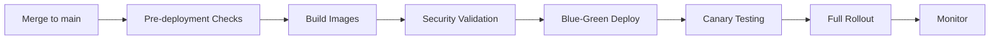

# Honua CI/CD Pipeline Documentation

This document provides comprehensive information about the CI/CD pipelines configured for the Honua build orchestration system.

## Table of Contents

- [Overview](#overview)
- [Architecture](#architecture)
- [Pipeline Platforms](#pipeline-platforms)
- [Workflows](#workflows)
- [Deployment Environments](#deployment-environments)
- [Required Secrets](#required-secrets)
- [Usage Guide](#usage-guide)
- [Troubleshooting](#troubleshooting)

## Overview

Honua uses a comprehensive CI/CD pipeline setup that supports:

- **Multi-cloud deployments**: AWS EKS, Azure AKS, GCP GKE
- **Multi-architecture builds**: AMD64 and ARM64
- **Multiple container registries**: GHCR, AWS ECR, Azure ACR, GCP GCR
- **Automated testing**: Unit, Integration, E2E, Performance, and Security tests
- **Blue-green deployments** with automatic rollback
- **Security scanning**: Container vulnerability scanning, SAST, SBOM generation

## Architecture

```
┌─────────────────────────────────────────────────────────────────┐
│                        Source Control                            │
│              GitHub / Azure DevOps / GitLab                      │
└───────────────────────────┬─────────────────────────────────────┘
                            │
                            ▼
┌─────────────────────────────────────────────────────────────────┐
│                       CI Pipeline                                │
│  ┌──────────┬──────────┬──────────┬──────────┬──────────┐      │
│  │  Build   │  Test    │ Security │ Package  │  Scan    │      │
│  │  (Multi  │  (Unit,  │ (SAST,   │ (Docker  │ (Trivy,  │      │
│  │   Arch)  │   Int,   │  Deps)   │  Multi-  │  Grype)  │      │
│  │          │   E2E)   │          │  Arch)   │          │      │
│  └──────────┴──────────┴──────────┴──────────┴──────────┘      │
└───────────────────────────┬─────────────────────────────────────┘
                            │
                            ▼
┌─────────────────────────────────────────────────────────────────┐
│                   Container Registries                           │
│  ┌────────┬───────────┬───────────┬───────────┬─────────┐      │
│  │  GHCR  │  AWS ECR  │ Azure ACR │  GCP GCR  │  Docker │      │
│  │        │           │           │           │   Hub   │      │
│  └────────┴───────────┴───────────┴───────────┴─────────┘      │
└───────────────────────────┬─────────────────────────────────────┘
                            │
                            ▼
┌─────────────────────────────────────────────────────────────────┐
│                      CD Pipeline                                 │
│  ┌──────────────┬─────────────────┬──────────────────┐         │
│  │ Development  │     Staging     │    Production    │         │
│  │  (Auto)      │  (On PR Merge)  │  (Manual Approval)         │
│  └──────────────┴─────────────────┴──────────────────┘         │
└───────────────────────────┬─────────────────────────────────────┘
                            │
                            ▼
┌─────────────────────────────────────────────────────────────────┐
│                   Kubernetes Clusters                            │
│  ┌──────────┬──────────┬──────────┬──────────┬──────────┐      │
│  │ AWS EKS  │Azure AKS │ GCP GKE  │ AWS EKS  │Azure AKS │      │
│  │  (Dev)   │  (Dev)   │  (Dev)   │ (Staging)│(Staging) │      │
│  └──────────┴──────────┴──────────┴──────────┴──────────┘      │
│  ┌──────────┬──────────┬──────────┐                             │
│  │ GCP GKE  │ AWS EKS  │Azure AKS │                             │
│  │(Staging) │  (Prod)  │  (Prod)  │                             │
│  └──────────┴──────────┴──────────┘                             │
└─────────────────────────────────────────────────────────────────┘
```

## Pipeline Platforms

### GitHub Actions

Location: `.github/workflows/`

**Workflows:**
- `ci.yml` - Build, test, and lint on all PRs
- `build-and-push.yml` - Multi-architecture Docker image builds
- `deploy-dev.yml` - Deploy to development environments
- `deploy-staging.yml` - Deploy to staging with blue-green strategy
- `deploy-production.yml` - Production deployment with manual approval
- `security-scan.yml` - Trivy and dependency scanning
- `helm-lint.yml` - Helm chart validation
- `integration-tests.yml` - Integration tests with Testcontainers
- `release.yml` - Create releases and publish artifacts
- `cleanup-cache.yml` - Automated cache cleanup

### Azure DevOps

Location: `.azure-pipelines/`

**Pipelines:**
- `azure-pipelines.yml` - Main pipeline orchestration
- `build-template.yml` - Reusable build template
- `deploy-template.yml` - Reusable deployment template
- `test-template.yml` - Test execution template

### GitLab CI

Location: `.gitlab-ci.yml`

**Stages:**
1. Build - Multi-architecture builds
2. Test - Unit, integration, E2E tests
3. Security - SAST, dependency scanning, container scanning
4. Package - Docker image builds and SBOM generation
5. Deploy - Environment-specific deployments
6. Notify - Slack/Teams notifications

## Workflows

### Pull Request Workflow



**Triggers:**
- On pull request to `dev`, `main`, or `master` branches
- On code changes (excludes docs and markdown files)

**Steps:**
1. Checkout code
2. Setup .NET SDK
3. Restore dependencies
4. Build solution
5. Run unit tests with coverage
6. Run integration tests
7. Run security scans (SAST, dependency check)
8. Lint code
9. Report results

### Development Deployment Workflow



**Triggers:**
- Push to `dev` branch
- Manual trigger

**Deployment Targets:**
- AWS EKS (dev cluster)
- Azure AKS (dev cluster)
- GCP GKE (dev cluster)
- GCP Cloud Run (optional)

**Process:**
1. Build and test code
2. Build multi-arch Docker images
3. Scan for vulnerabilities
4. Push to container registries
5. Deploy to Kubernetes using Helm
6. Run database migrations
7. Execute smoke tests
8. Verify deployment health

### Staging Deployment Workflow



**Triggers:**
- Push to `main` or `master` branch
- Manual trigger with image tag

**Features:**
- Pre-deployment validation
- Image verification
- Breaking change detection
- Database migration validation
- Blue-green deployment strategy
- Automated rollback on failure
- Comprehensive smoke tests

**Process:**
1. Validate image exists and is scanned
2. Check for breaking changes
3. Backup current deployment
4. Run database migrations with backup
5. Deploy green version (new)
6. Test green deployment
7. Switch traffic to green
8. Monitor for issues
9. Remove old blue deployment

### Production Deployment Workflow

```mermaid
graph LR
    A[Tag Release] --> B[Approval Request]
    B --> C[Manual Approval]
    C --> D[Pre-deployment Validation]
    D --> E[Full Backup]
    E --> F[Database Migrations]
    F --> G[Canary 10%]
    G --> H[Monitor 5min]
    H --> I[Canary 50%]
    I --> J[Integration Tests]
    J --> K[Full Rollout 100%]
    K --> L[Post-deployment Verification]
```



**Triggers:**
- Manual trigger only
- Requires image tag and cloud provider selection

**Approval Process:**
1. Create deployment request issue
2. Pre-deployment checklist validation
3. Manual approval by authorized personnel
4. Comprehensive security scans
5. Configuration validation
6. System capacity check

**Deployment Process:**
1. **Validation Phase**
   - Validate inputs and image tag
   - Verify image exists and is signed
   - Check staging deployment success
   - Run security scans

2. **Approval Phase**
   - Create approval issue
   - Wait for manual approval from production approvers

3. **Pre-deployment Phase**
   - Full system backup
   - Store current deployment state
   - Enable maintenance mode (optional)

4. **Migration Phase**
   - Scale to minimum replicas
   - Run database migrations
   - Verify database state

5. **Canary Deployment Phase**
   - Deploy canary version (10% traffic)
   - Monitor for 5 minutes
   - Check error rates and response times
   - Increase to 50% traffic if healthy
   - Run production integration tests

6. **Full Rollout Phase**
   - Update main deployment to new version
   - Route 100% traffic to new version
   - Monitor for 5 minutes
   - Verify all pods healthy

7. **Cleanup Phase**
   - Remove canary deployment
   - Disable maintenance mode
   - Run verification tests
   - Create deployment tags

8. **Post-deployment Phase**
   - Run synthetic monitoring
   - Verify metrics flow
   - Update deployment records
   - Generate deployment summary

**Rollback Procedure:**
If any step fails:
1. Emergency notification sent
2. Traffic routed back to previous version
3. Canary deployment removed
4. Database rollback if needed
5. Restore from backup
6. Incident report created

## Deployment Environments

### Development

**Purpose:** Feature development and testing

**Configuration:**
- **Replicas:** 2
- **Auto-scaling:** Disabled
- **Resources:**
  - CPU: 500m request, 1000m limit
  - Memory: 512Mi request, 1Gi limit
- **Deployment:** Automatic on merge to `dev`
- **Rollback:** Automatic on failure

**Access:**
- AWS: `https://dev-aws.honua.example.com`
- Azure: `https://dev-azure.honua.example.com`
- GCP: `https://dev-gcp.honua.example.com`

### Staging

**Purpose:** Pre-production testing and validation

**Configuration:**
- **Replicas:** 3-10 (auto-scaled)
- **Auto-scaling:** Enabled
- **Resources:**
  - CPU: 1000m request, 2000m limit
  - Memory: 1Gi request, 2Gi limit
- **Deployment:** Automatic on merge to `main`
- **Strategy:** Blue-green with canary testing
- **Rollback:** Automatic on failure

**Access:**
- AWS: `https://staging-aws.honua.example.com`
- Azure: `https://staging-azure.honua.example.com`
- GCP: `https://staging-gcp.honua.example.com`

### Production

**Purpose:** Live production environment

**Configuration:**
- **Replicas:** 5-20 (auto-scaled)
- **Auto-scaling:** Enabled with aggressive scaling
- **Resources:**
  - CPU: 2000m request, 4000m limit
  - Memory: 2Gi request, 4Gi limit
- **Deployment:** Manual approval required
- **Strategy:** Canary deployment (10% → 50% → 100%)
- **Rollback:** Manual or automatic on critical failures

**Access:**
- AWS: `https://aws.honua.example.com`
- Azure: `https://azure.honua.example.com`
- GCP: `https://gcp.honua.example.com`

## Required Secrets

### GitHub Actions

Configure these secrets in GitHub Settings → Secrets and Variables → Actions:

#### Container Registries

```yaml
# GitHub Container Registry (automatically configured)
GITHUB_TOKEN: <automatic>

# AWS ECR
AWS_ACCESS_KEY_ID: <aws-access-key>
AWS_SECRET_ACCESS_KEY: <aws-secret-key>
AWS_ECR_ALIAS: <ecr-public-alias>

# Azure ACR
AZURE_REGISTRY_NAME: <registry-name>
AZURE_REGISTRY_USERNAME: <username>
AZURE_REGISTRY_PASSWORD: <password>

# GCP GCR
GCP_PROJECT_ID: <project-id>
GCP_SERVICE_ACCOUNT_KEY: <service-account-json>
```

#### Cloud Provider Credentials

```yaml
# AWS
AWS_REGION: us-east-1
AWS_EKS_CLUSTER_NAME_DEV: honua-dev
AWS_EKS_CLUSTER_NAME_STAGING: honua-staging
AWS_EKS_CLUSTER_NAME_PROD: honua-production
AWS_PRODUCTION_ROLE_ARN: <production-role-arn>

# Azure
AZURE_CREDENTIALS: <service-principal-json>
AZURE_CREDENTIALS_PRODUCTION: <production-sp-json>
AZURE_RESOURCE_GROUP_DEV: honua-dev-rg
AZURE_RESOURCE_GROUP_STAGING: honua-staging-rg
AZURE_RESOURCE_GROUP_PROD: honua-prod-rg
AZURE_AKS_CLUSTER_NAME_DEV: honua-dev-aks
AZURE_AKS_CLUSTER_NAME_STAGING: honua-staging-aks
AZURE_AKS_CLUSTER_NAME_PROD: honua-prod-aks
AZURE_KEYVAULT_NAME_DEV: honua-dev-kv
AZURE_KEYVAULT_NAME_STAGING: honua-staging-kv
AZURE_KEYVAULT_NAME_PROD: honua-prod-kv

# GCP
GCP_REGION: us-central1
GCP_GKE_CLUSTER_NAME_DEV: honua-dev-gke
GCP_GKE_CLUSTER_NAME_STAGING: honua-staging-gke
GCP_GKE_CLUSTER_NAME_PROD: honua-prod-gke
GCP_SERVICE_ACCOUNT_KEY_PRODUCTION: <production-sa-json>
```

#### Application Secrets

```yaml
STAGING_API_KEY: <staging-api-key>
PRODUCTION_API_KEY: <production-api-key>
```

#### Notification Services

```yaml
SLACK_WEBHOOK_URL: <slack-webhook-url>
TEAMS_WEBHOOK_URL: <teams-webhook-url>
```

#### Optional Services

```yaml
# Image Signing
COSIGN_PRIVATE_KEY: <cosign-private-key>
COSIGN_PASSWORD: <cosign-password>

# Helm Repository
HELM_REPO_URL: <helm-repo-url>
HELM_REPO_USERNAME: <username>
HELM_REPO_PASSWORD: <password>

# SonarCloud
SONAR_TOKEN: <sonarcloud-token>

# Personal Access Token for releases
PAT_TOKEN: <github-pat>
```

### GitHub Variables

Configure these in GitHub Settings → Secrets and Variables → Actions → Variables:

```yaml
# Feature Flags
ENABLE_AWS_ECR: 'true'
ENABLE_AZURE_ACR: 'true'
ENABLE_GCP_GCR: 'true'
ENABLE_CLOUD_RUN: 'false'
ENABLE_IMAGE_SIGNING: 'true'
ENABLE_MAINTENANCE_MODE: 'false'
ENABLE_SLACK_NOTIFICATIONS: 'true'
ENABLE_TEAMS_NOTIFICATIONS: 'false'
ENABLE_HELM_PUBLISH: 'false'
```

### Azure DevOps

Configure these in Azure DevOps → Project Settings → Service Connections and Variable Groups:

#### Service Connections

Create service connections for:
- Azure Resource Manager (for each environment)
- Docker Registry (for ACR)
- GitHub (for releases)
- AWS
- GCP
- SonarCloud

#### Variable Groups

**honua-build-vars:**
```yaml
dotnetVersion: '9.0.x'
buildConfiguration: 'Release'
imageRepository: 'honuaacr.azurecr.io/honua-server'
```

**honua-container-registry:**
```yaml
acrServiceConnection: 'honua-acr'
dockerHubServiceConnection: 'docker-hub'
```

**honua-aws-dev:**
```yaml
awsServiceConnection: 'aws-dev'
awsRegion: 'us-east-1'
eksClusterName: 'honua-dev'
```

**honua-azure-dev:**
```yaml
azureSubscription: 'azure-dev-subscription'
aksResourceGroup: 'honua-dev-rg'
aksClusterName: 'honua-dev-aks'
```

**honua-gcp-dev:**
```yaml
gcpServiceConnection: 'gcp-dev'
gcpProject: 'honua-dev'
gcpRegion: 'us-central1'
gkeClusterName: 'honua-dev-gke'
```

(Similar variable groups for staging and production)

### GitLab CI

Configure these in GitLab → Settings → CI/CD → Variables:

```yaml
# Docker Registry
CI_REGISTRY_USER: <username>
CI_REGISTRY_PASSWORD: <password>

# AWS
AWS_ACCESS_KEY_ID: <key>
AWS_SECRET_ACCESS_KEY: <secret>
AWS_REGION: us-east-1
AWS_ECR_REGISTRY: <registry-url>
AWS_EKS_CLUSTER_NAME: honua-dev

# Azure
AZURE_CLIENT_ID: <client-id>
AZURE_CLIENT_SECRET: <secret>
AZURE_TENANT_ID: <tenant-id>
AZURE_SUBSCRIPTION_ID: <subscription-id>
AZURE_RESOURCE_GROUP: honua-dev-rg
AZURE_AKS_CLUSTER_NAME: honua-dev-aks
AZURE_KEYVAULT_NAME: honua-dev-kv

# GCP
GCP_PROJECT_ID: <project-id>
GCP_REGION: us-central1
GCP_SERVICE_ACCOUNT_KEY: <json-key>
GCP_GCR_REGISTRY: gcr.io
GCP_GKE_CLUSTER_NAME: honua-dev-gke

# Notifications
SLACK_WEBHOOK_URL: <webhook-url>
```

## Usage Guide

### Triggering Builds

#### GitHub Actions

**Automatic triggers:**
```bash
# Development deployment
git push origin dev

# Staging deployment
git push origin main

# Create a release
git tag -a v1.0.0 -m "Release 1.0.0"
git push origin v1.0.0
```

**Manual triggers:**
1. Go to Actions tab
2. Select workflow
3. Click "Run workflow"
4. Fill in required inputs
5. Click "Run workflow"

#### Azure DevOps

**Queue pipeline:**
```bash
# Using Azure CLI
az pipelines run --name "Honua CI/CD" \
  --parameters deployEnvironment=Dev

# Or use the web UI
# Pipelines → Honua CI/CD → Run pipeline
```

#### GitLab CI

**Trigger pipeline:**
```bash
# Push to trigger automatic pipeline
git push origin dev

# Manual pipeline with API
curl -X POST \
  -F token=<trigger-token> \
  -F ref=main \
  https://gitlab.com/api/v4/projects/<project-id>/trigger/pipeline
```

### Building Multi-Architecture Images

**Using the build script:**
```bash
# Local build
./scripts/build-multi-arch.sh \
  --name honua-server \
  --version 1.0.0

# Build and push
./scripts/build-multi-arch.sh \
  --name ghcr.io/myorg/honua-server \
  --version 1.0.0 \
  --push

# With caching
./scripts/build-multi-arch.sh \
  --name honua-server \
  --version 1.0.0 \
  --cache-from type=registry,ref=honua-server:buildcache \
  --cache-to type=registry,ref=honua-server:buildcache,mode=max \
  --push
```

### Pushing to Multiple Registries

**Using the push script:**
```bash
# Configure registries via environment variables
export GHCR_ENABLED=true
export GHCR_USERNAME=myuser
export GHCR_TOKEN=ghp_xxx
export GHCR_ORG=myorg

export AWS_ECR_ENABLED=true
export AWS_ECR_REGISTRY=123456789.dkr.ecr.us-east-1.amazonaws.com
export AWS_ACCESS_KEY_ID=xxx
export AWS_SECRET_ACCESS_KEY=xxx

# Push to all configured registries
./scripts/push-to-registries.sh \
  --name honua-server \
  --version 1.0.0 \
  --source honua-server:1.0.0
```

### Deploying to Kubernetes

**Using the deployment script:**
```bash
# Deploy to development on AWS
./scripts/deploy-k8s.sh dev aws ghcr.io/myorg/honua-server:1.0.0

# Deploy to staging on Azure
./scripts/deploy-k8s.sh staging azure myregistry.azurecr.io/honua-server:1.0.0

# Deploy to production on GCP
./scripts/deploy-k8s.sh production gcp gcr.io/project/honua-server:1.0.0
```

### Running Tests

**Using the test script:**
```bash
# Run all tests
./scripts/run-tests.sh

# Run specific test types
./scripts/run-tests.sh unit
./scripts/run-tests.sh integration
./scripts/run-tests.sh e2e
./scripts/run-tests.sh performance

# With coverage
COVERAGE=true ./scripts/run-tests.sh unit

# Verbose output
VERBOSE=true ./scripts/run-tests.sh all
```

### Creating a Release

**Complete release process:**

1. **Prepare release:**
```bash
# Update version in code
# Update CHANGELOG.md
# Commit changes
git add .
git commit -m "chore: prepare release 1.0.0"
```

2. **Create and push tag:**
```bash
git tag -a v1.0.0 -m "Release 1.0.0"
git push origin v1.0.0
```

3. **Monitor release workflow:**
- GitHub Actions will automatically:
  - Build multi-arch binaries for all platforms
  - Build and push container images
  - Generate SBOMs
  - Sign images with Cosign
  - Create GitHub release
  - Publish to Helm repository (if enabled)

4. **Deploy to production:**
- Go to GitHub Actions
- Select "Deploy to Production" workflow
- Click "Run workflow"
- Enter image tag: `v1.0.0`
- Select cloud provider or "all"
- Approve deployment when prompted

## Troubleshooting

### Common Issues

#### Build Failures

**Problem:** Build fails with "dotnet command not found"
```bash
# Solution: Ensure .NET SDK is installed
dotnet --version

# Or install .NET SDK
wget https://dot.net/v1/dotnet-install.sh
chmod +x dotnet-install.sh
./dotnet-install.sh --version 9.0
```

**Problem:** NuGet restore fails
```bash
# Solution: Clear NuGet cache
dotnet nuget locals all --clear

# Restore with verbose logging
dotnet restore --verbosity detailed
```

#### Docker Build Issues

**Problem:** Multi-arch build fails on ARM64
```bash
# Solution: Enable QEMU emulation
docker run --privileged --rm tonistiigi/binfmt --install all

# Verify QEMU is working
docker buildx ls
```

**Problem:** Docker build runs out of disk space
```bash
# Solution: Clean up Docker
docker system prune -af --volumes

# Check disk usage
docker system df
```

#### Deployment Failures

**Problem:** kubectl cannot connect to cluster
```bash
# Solution: Re-configure kubectl

# For AWS EKS
aws eks update-kubeconfig --region us-east-1 --name honua-dev

# For Azure AKS
az aks get-credentials --resource-group honua-dev-rg --name honua-dev-aks

# For GCP GKE
gcloud container clusters get-credentials honua-dev-gke --region us-central1
```

**Problem:** Helm deployment fails with timeout
```bash
# Solution: Increase timeout and check pod status
helm upgrade --install honua-server ./deploy/helm/honua-server \
  --timeout 20m \
  --wait

# Check pod status
kubectl get pods -n honua-dev
kubectl describe pod <pod-name> -n honua-dev
kubectl logs <pod-name> -n honua-dev
```

**Problem:** Database migrations fail
```bash
# Solution: Check migration logs and database connectivity
kubectl logs honua-migrations-xxx -n honua-dev

# Test database connection
kubectl run -it --rm debug --image=postgres:16 --restart=Never -- \
  psql -h postgres-host -U username -d database
```

#### Test Failures

**Problem:** Integration tests fail to connect to services
```bash
# Solution: Verify services are running
docker-compose -f docker-compose.test.yml ps

# Check service logs
docker-compose -f docker-compose.test.yml logs postgres
docker-compose -f docker-compose.test.yml logs redis

# Restart services
docker-compose -f docker-compose.test.yml down -v
docker-compose -f docker-compose.test.yml up -d
```

**Problem:** E2E tests timeout
```bash
# Solution: Increase timeout and check application logs
E2E_TIMEOUT=300000 ./scripts/run-tests.sh e2e

# Check application logs
docker-compose -f docker-compose.test.yml logs app
```

### Getting Help

**Pipeline Logs:**
- **GitHub Actions:** Actions tab → Select workflow run → View logs
- **Azure DevOps:** Pipelines → Select run → View logs
- **GitLab CI:** CI/CD → Pipelines → Select pipeline → View logs

**Debugging:**
```bash
# Enable verbose logging
export VERBOSE=true

# Run scripts with bash debug mode
bash -x ./scripts/deploy-k8s.sh dev aws image:tag

# Check Kubernetes events
kubectl get events -n honua-dev --sort-by='.lastTimestamp'

# Describe resources
kubectl describe deployment honua-server -n honua-dev
kubectl describe pod <pod-name> -n honua-dev
```

**Support Channels:**
- GitHub Issues: https://github.com/yourorg/honua/issues
- Slack: #honua-support
- Email: devops@example.com

---

**Last Updated:** $(date)
**Maintained By:** DevOps Team
