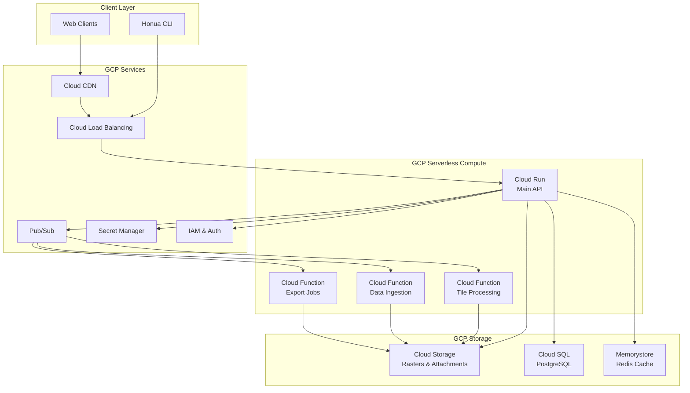

# Google Cloud Platform Integration for Honua

## Executive Summary
This document outlines the implementation of Google Cloud Platform (GCP) support for Honua, enabling serverless deployment using Cloud Run, file storage with Cloud Storage, and async processing with Cloud Functions.

## Architecture Overview



## Component Implementation

### 1. Google Cloud Storage Integration

#### Raster Storage Provider
```csharp
// src/Honua.Server.Core/Raster/Sources/GcsRasterSourceProvider.cs
public class GcsRasterSourceProvider : IRasterSourceProvider
{
    - Bucket management
    - Signed URL generation
    - Streaming downloads
    - Multi-region support
}
```

#### Attachment Store
```csharp
// src/Honua.Server.Core/Attachments/GcsAttachmentStore.cs
public class GcsAttachmentStore : IAttachmentStore
{
    - Upload/download attachments
    - Metadata management
    - Access control
    - Lifecycle policies
}
```

#### Tile Cache Provider
```csharp
// src/Honua.Server.Core/Raster/Caching/GcsRasterTileCacheProvider.cs
public class GcsRasterTileCacheProvider : IRasterTileCacheProvider
{
    - Cache tiles in GCS
    - CDN integration
    - TTL management
    - Cost optimization
}
```

### 2. Cloud Run Deployment

#### Containerization
```dockerfile
# Dockerfile.cloudrun
FROM mcr.microsoft.com/dotnet/aspnet:8.0-alpine AS runtime
- Optimized for Cloud Run
- Health checks
- Graceful shutdown
- Memory optimization
```

#### Service Configuration
```yaml
# cloudrun.yaml
apiVersion: serving.knative.dev/v1
kind: Service
metadata:
  name: honua-api
spec:
  template:
    metadata:
      annotations:
        run.googleapis.com/execution-environment: gen2
        run.googleapis.com/cpu-throttling: "false"
    spec:
      serviceAccountName: honua-sa
      containerConcurrency: 1000
      timeoutSeconds: 300
      containers:
      - image: gcr.io/PROJECT_ID/honua-api
        resources:
          limits:
            cpu: "4"
            memory: "8Gi"
        env:
        - name: ASPNETCORE_ENVIRONMENT
          value: Production
```

### 3. Cloud Functions for Async Processing

#### Tile Generation Function
```csharp
// functions/TileGenerator/Function.cs
[FunctionsStartup(typeof(TileGeneratorStartup))]
public class TileGeneratorFunction : ICloudEventFunction<TileRequest>
{
    public async Task HandleAsync(CloudEvent<TileRequest> cloudEvent)
    {
        - Process tile generation request
        - Store in Cloud Storage
        - Update cache
        - Notify completion
    }
}
```

#### Data Ingestion Function
```csharp
// functions/DataIngestion/Function.cs
public class DataIngestionFunction : ICloudEventFunction<IngestionRequest>
{
    - Process large datasets
    - Stream processing
    - Progress tracking
    - Error handling
}
```

### 4. Authentication & Authorization

#### Identity Platform Integration
```csharp
// src/Honua.Server.Core/Authentication/GcpAuthenticationService.cs
public class GcpAuthenticationService : IAuthenticationService
{
    - Firebase Auth integration
    - Service account management
    - Workload identity
    - API key validation
}
```

#### IAM Integration
```csharp
// src/Honua.Server.Core/Authorization/GcpAuthorizationService.cs
public class GcpAuthorizationService : IAuthorizationService
{
    - IAM policy evaluation
    - Resource-based permissions
    - Custom roles
    - Audit logging
}
```

### 5. Data Storage

#### Cloud SQL Configuration
```sql
-- Cloud SQL PostgreSQL with PostGIS
CREATE EXTENSION IF NOT EXISTS postgis;
CREATE EXTENSION IF NOT EXISTS pg_stat_statements;

-- High availability configuration
-- Read replicas for scaling
-- Automated backups
-- Point-in-time recovery
```

#### Memorystore Redis
```csharp
// src/Honua.Server.Core/Caching/MemorystoreProvider.cs
public class MemorystoreProvider : ICacheProvider
{
    - Redis cluster support
    - Automatic failover
    - Connection pooling
    - Monitoring integration
}
```

## Implementation Phases

### Phase 1: Core Storage (Week 1)
- [x] Design document
- [ ] GCS Raster Source Provider
- [ ] GCS Attachment Store
- [ ] GCS Tile Cache Provider
- [ ] Unit tests

### Phase 2: Cloud Run Deployment (Week 2)
- [ ] Dockerfile optimization
- [ ] Cloud Run service config
- [ ] CI/CD pipeline (Cloud Build)
- [ ] Load testing
- [ ] Auto-scaling configuration

### Phase 3: Serverless Functions (Week 3)
- [ ] Tile generation function
- [ ] Data ingestion function
- [ ] Export function
- [ ] Pub/Sub integration
- [ ] Dead letter queues

### Phase 4: Authentication & Security (Week 4)
- [ ] Identity Platform integration
- [ ] IAM policies
- [ ] Secret Manager integration
- [ ] VPC configuration
- [ ] Cloud Armor rules

### Phase 5: Infrastructure as Code (Week 5)
- [ ] Terraform modules
- [ ] GitHub Actions workflows
- [ ] Monitoring & alerting
- [ ] Cost optimization
- [ ] Documentation

## Configuration

### Application Settings
```json
{
  "GoogleCloud": {
    "ProjectId": "honua-prod",
    "Region": "us-central1",
    "Storage": {
      "RasterBucket": "honua-rasters",
      "AttachmentBucket": "honua-attachments",
      "TileCacheBucket": "honua-tiles",
      "SignedUrlExpiration": 3600
    },
    "CloudSQL": {
      "InstanceConnection": "project:region:instance",
      "Database": "honua",
      "EnableIamAuth": true
    },
    "Memorystore": {
      "Endpoint": "redis.googleapis.com:6379",
      "UseSsl": true
    },
    "PubSub": {
      "TileProcessingTopic": "tile-processing",
      "DataIngestionTopic": "data-ingestion",
      "ExportTopic": "export-jobs"
    }
  }
}
```

## Cost Optimization

### Storage Tiers
- **Standard**: Frequently accessed rasters
- **Nearline**: Monthly accessed data
- **Coldline**: Quarterly accessed archives
- **Archive**: Yearly compliance data

### Compute Optimization
- **Cloud Run**: Auto-scaling to zero
- **Cloud Functions**: Pay per invocation
- **Preemptible VMs**: Batch processing
- **Committed use discounts**: Predictable workloads

### Caching Strategy
- **Cloud CDN**: Static tiles
- **Memorystore**: Hot data
- **Local memory**: Request cache
- **Edge caching**: Global distribution

## Monitoring & Observability

### Cloud Monitoring
```yaml
# monitoring/alerts.yaml
- Latency > 1s for P95
- Error rate > 1%
- Cloud Run instances > 50
- Storage usage > 80%
- Database connections > 90%
```

### Cloud Logging
```csharp
// Structured logging with Cloud Logging
services.AddLogging(builder =>
{
    builder.AddGoogle(new GoogleLoggerOptions
    {
        ProjectId = projectId,
        ServiceName = "honua-api",
        Version = version,
        Labels = labels
    });
});
```

### Cloud Trace
```csharp
// Distributed tracing
services.AddGoogleTrace(options =>
{
    options.ProjectId = projectId;
    options.TraceIdRatio = 0.1; // Sample 10%
});
```

## Security Best Practices

1. **Least Privilege**: Minimal IAM permissions
2. **Encryption**: At-rest and in-transit
3. **Network Security**: Private IP, Cloud NAT
4. **Secrets Management**: No hardcoded credentials
5. **Audit Logging**: All API access logged
6. **DDoS Protection**: Cloud Armor rules
7. **Container Security**: Distroless images
8. **Supply Chain**: Binary Authorization

## Performance Targets

| Metric | Target | Measurement |
|--------|--------|-------------|
| API Latency (P50) | < 100ms | Cloud Monitoring |
| API Latency (P99) | < 500ms | Cloud Monitoring |
| Tile Generation | < 2s | Cloud Functions logs |
| Data Ingestion | < 10 MB/s | Pub/Sub metrics |
| Availability | 99.95% | Uptime checks |
| Error Rate | < 0.1% | Error reporting |
| Cost per Request | < $0.0001 | Billing reports |

## Migration Strategy

### From AWS/Azure to GCP
1. **Data Migration**: Transfer service for large datasets
2. **Dual-Running**: Gradual traffic shift
3. **Rollback Plan**: Keep original infrastructure
4. **Testing**: Load testing before cutover
5. **DNS Update**: Route53/Traffic Manager to Cloud DNS

## Disaster Recovery

- **RTO**: 1 hour
- **RPO**: 15 minutes
- **Multi-region**: Failover to secondary region
- **Backups**: Automated daily snapshots
- **Restore Testing**: Quarterly DR drills

## Compliance

- **GDPR**: Data residency controls
- **HIPAA**: Encryption and audit logs
- **SOC2**: Security controls
- **ISO 27001**: Information security
- **PCI DSS**: Payment card protection