# Architecture Diagrams
**Visual Guide to Honua.Server 3D Geospatial Platform**

This document contains comprehensive architecture diagrams for all major components of the Honua.Server 3D platform.

---

## Table of Contents

1. [Client-Side 3D Architecture](#1-client-side-3d-architecture)
2. [Blazor Interop Data Flow](#2-blazor-interop-data-flow)
3. [Drone Data Pipeline](#3-drone-data-pipeline)
4. [Meta Quest WebXR Integration](#4-meta-quest-webxr-integration)
5. [3D Geometry Stack](#5-3d-geometry-stack)
6. [Point Cloud Rendering Pipeline](#6-point-cloud-rendering-pipeline)
7. [Performance Optimization Flow](#7-performance-optimization-flow)

---

## 1. Client-Side 3D Architecture

### Complete Technology Stack

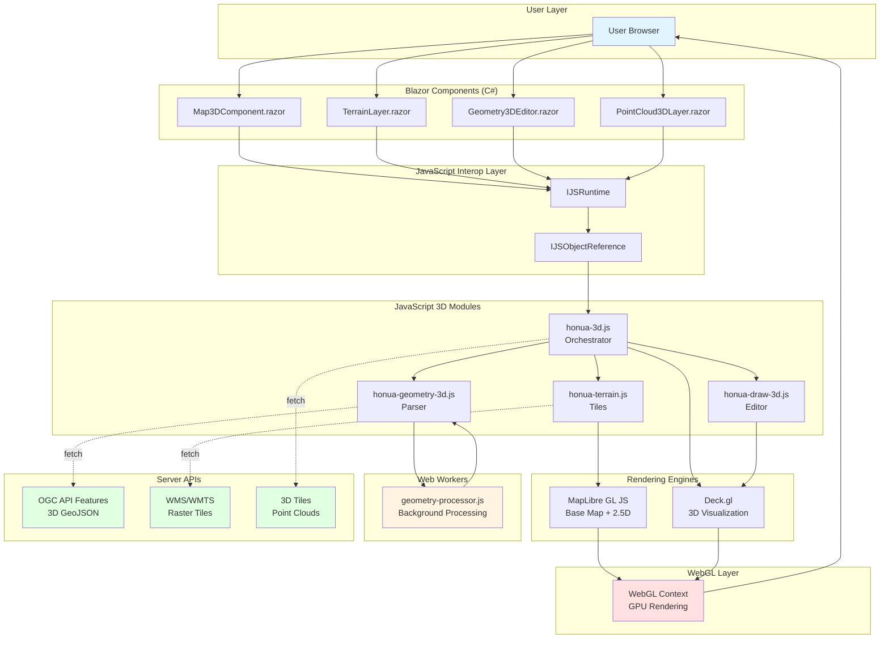

### Layer Interaction Flow

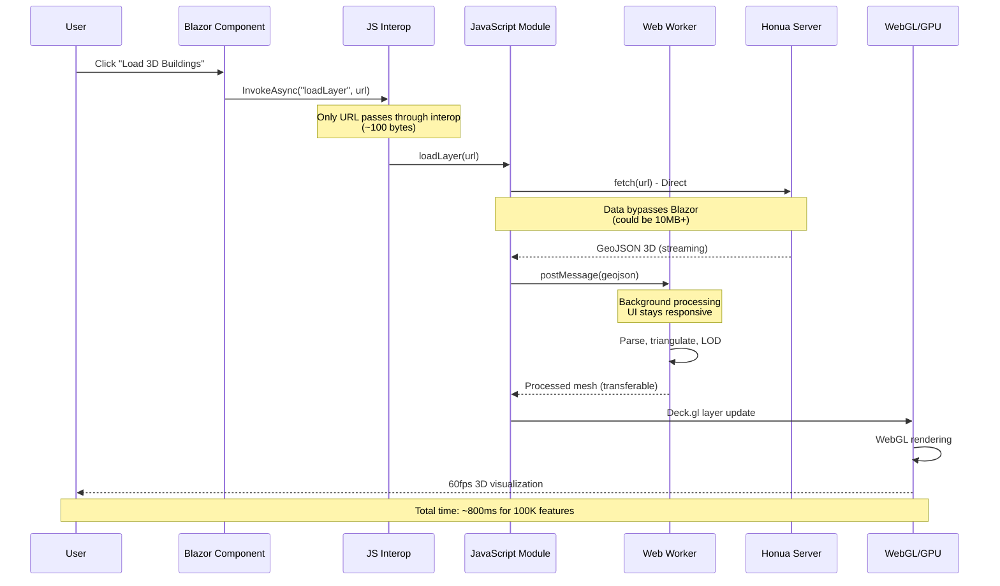

---

## 2. Blazor Interop Data Flow

### ❌ Bad Approach (Naive)

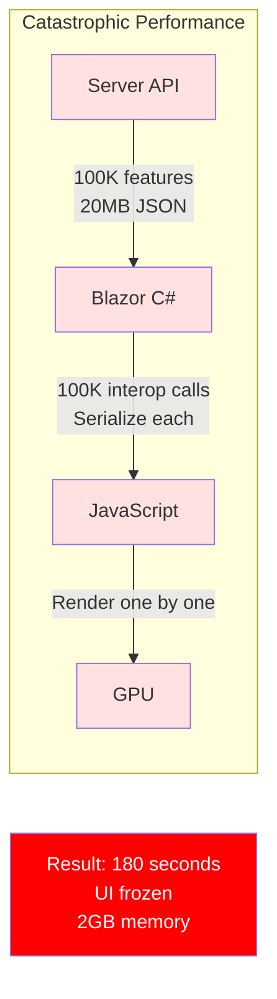

### ✅ Good Approach (Optimized)

```mermaid
graph TB
    subgraph "Optimized Architecture"
        Server[Server API]
        Blazor[Blazor C#<br/>Control Only]
        JS[JavaScript<br/>Data Handler]
        Worker[Web Worker<br/>Processing]
        GPU[GPU<br/>Rendering]
    end

    Blazor -->|Single interop call<br/>URL only (~100 bytes)| JS
    JS -->|Direct fetch<br/>Bypass Blazor| Server
    Server -->|Streaming GeoJSON<br/>20MB| JS
    JS -->|Transfer to worker<br/>Zero-copy| Worker
    Worker -->|Processed mesh<br/>Transferable| JS
    JS -->|Batch render| GPU

    style Blazor fill:#e1ffe1
    style JS fill:#e1ffe1
    style Worker fill:#e1ffe1
    style GPU fill:#e1ffe1

    Result[Result: 0.8 seconds<br/>60fps<br/>200MB memory]

    style Result fill:#00ff00,color:#000
```

### Performance Comparison

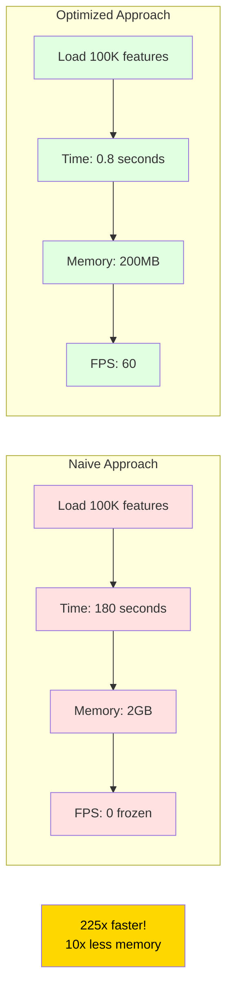

---

## 3. Drone Data Pipeline

### End-to-End Workflow

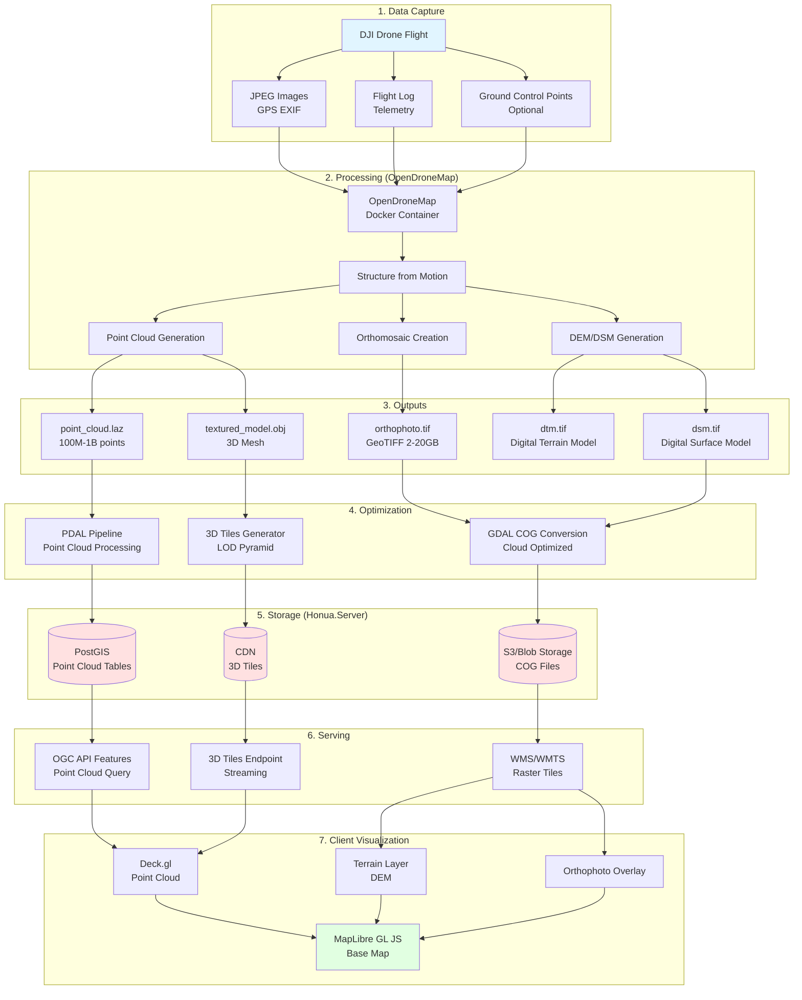

### Point Cloud LOD Strategy

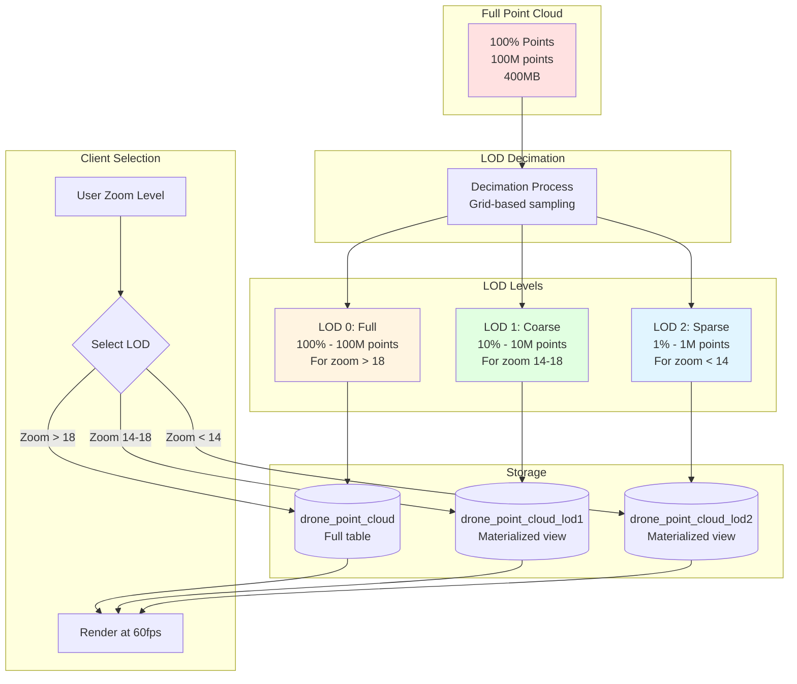

---

## 4. Meta Quest WebXR Integration

### WebXR Architecture

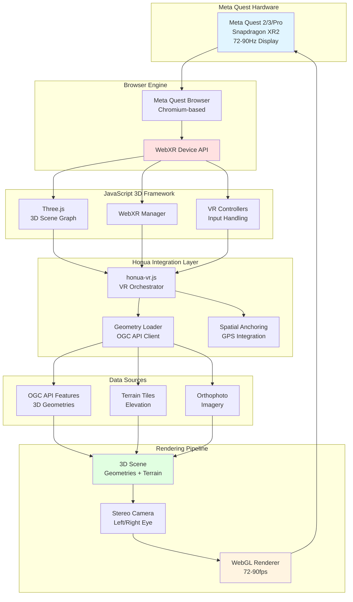

### User Interaction Flow in VR

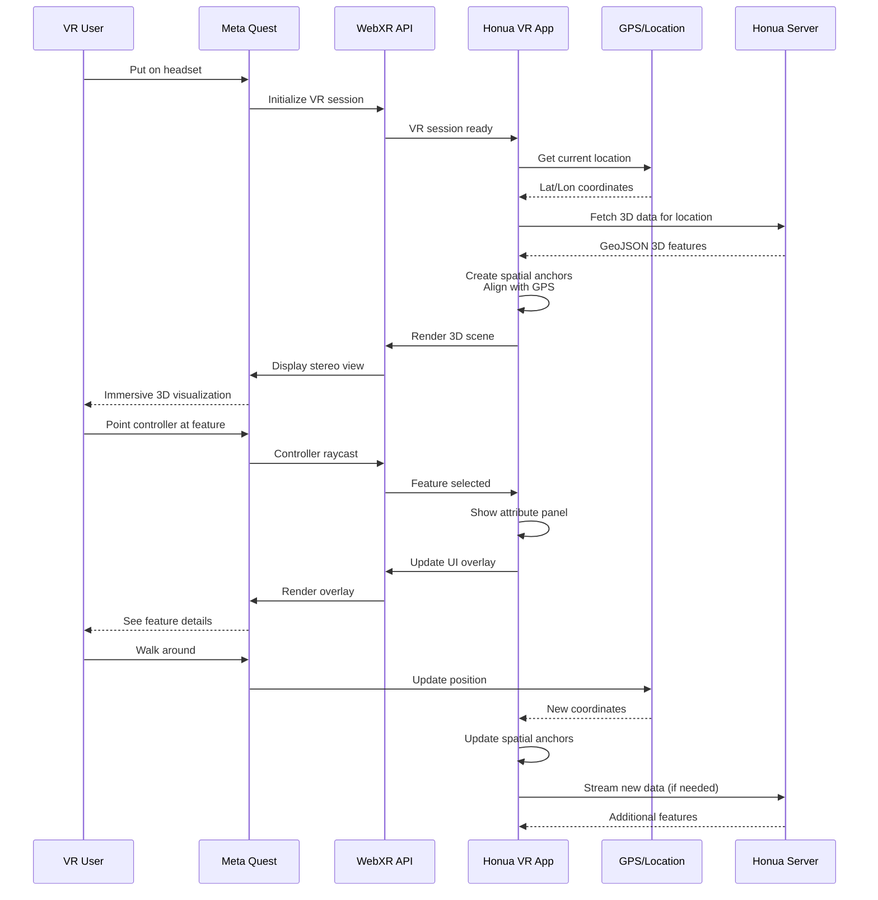

### Field Survey Use Case

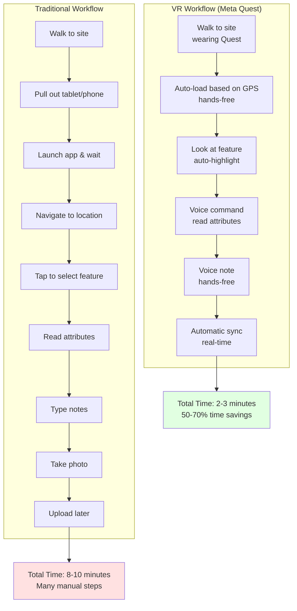

---

## 5. 3D Geometry Stack

### Complete Server-to-Client Flow

```mermaid
graph TB
    subgraph "Storage Layer (Server)"
        POSTGIS[(PostGIS Database<br/>PointZ, LineStringZ, PolygonZ)]
        SPATIALITE[(SpatiaLite<br/>3D Geometries)]
        GPKG[(GeoPackage<br/>3D Extension)]
    end

    subgraph "Server Processing (C#)"
        READER[GeometryReader.cs<br/>WKB/WKT/GeoJSON Parser]
        VALIDATOR[ThreeDimensionalValidator.cs<br/>Validation]
        HELPER[GeometryTypeHelper.cs<br/>Z/M Detection]
        TRANSFORM[CoordinateTransform3D.cs<br/>CRS Transformation]
    end

    subgraph "Serialization"
        GEOJSON[GeoJSON 3D<br/>[lon, lat, z]]
        WKT[WKT Z<br/>POINT Z (x y z)]
        WKB[WKB<br/>Binary format]
    end

    subgraph "OGC APIs"
        FEATURES[OGC API Features<br/>3D Queries]
        WFS[WFS 2.0<br/>3D Bbox support]
        CRS84H[CRS84H Support<br/>Ellipsoidal heights]
    end

    subgraph "Network Transport"
        HTTP[HTTP/2 Streaming]
        GZIP[GZIP Compression]
    end

    subgraph "Client Parsing (JavaScript)"
        PARSER[honua-geometry-3d.js<br/>Parse 3D coordinates]
        WORKER_PARSE[Web Worker<br/>Background parsing]
    end

    subgraph "Client Rendering"
        DECKGL_LAYER[Deck.gl Layers<br/>GeoJsonLayer 3D]
        WEBGL_RENDER[WebGL Rendering<br/>GPU acceleration]
    end

    subgraph "Display"
        SCREEN[60fps Display<br/>3D Visualization]
    end

    POSTGIS --> READER
    SPATIALITE --> READER
    GPKG --> READER

    READER --> VALIDATOR
    READER --> HELPER
    VALIDATOR --> TRANSFORM

    TRANSFORM --> GEOJSON
    TRANSFORM --> WKT
    TRANSFORM --> WKB

    GEOJSON --> FEATURES
    WKT --> WFS
    GEOJSON --> CRS84H

    FEATURES --> HTTP
    WFS --> HTTP
    CRS84H --> HTTP

    HTTP --> GZIP
    GZIP --> PARSER

    PARSER --> WORKER_PARSE
    WORKER_PARSE --> DECKGL_LAYER

    DECKGL_LAYER --> WEBGL_RENDER
    WEBGL_RENDER --> SCREEN

    style POSTGIS fill:#ffe1e1
    style READER fill:#fff4e1
    style GEOJSON fill:#e1ffe1
    style PARSER fill:#e1f5ff
    style SCREEN fill:#e1ffe1
```

### Coordinate System Flow

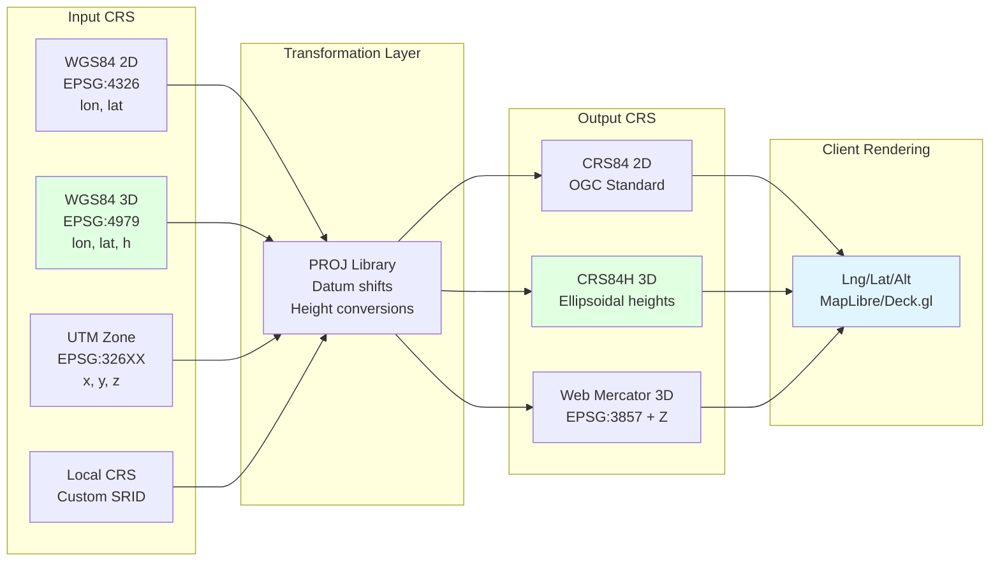

---

## 6. Point Cloud Rendering Pipeline

### High-Performance Rendering

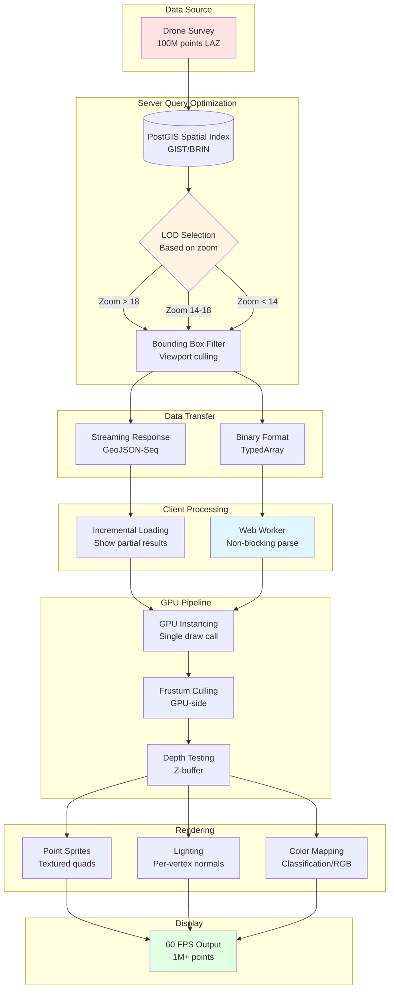

### Memory Management

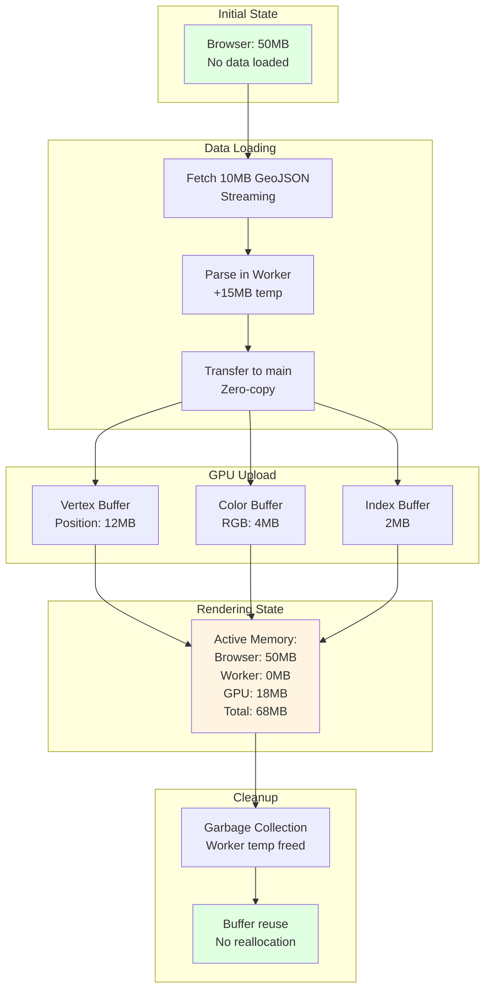

---

## 7. Performance Optimization Flow

### Request Lifecycle

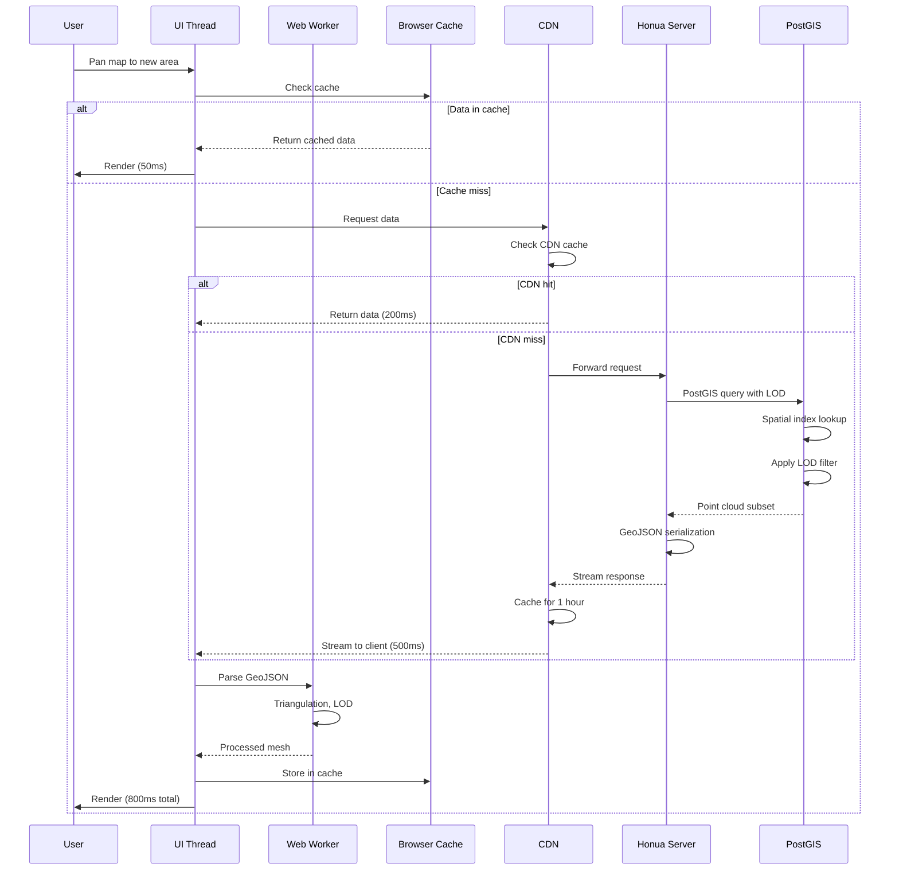

### Optimization Decision Tree

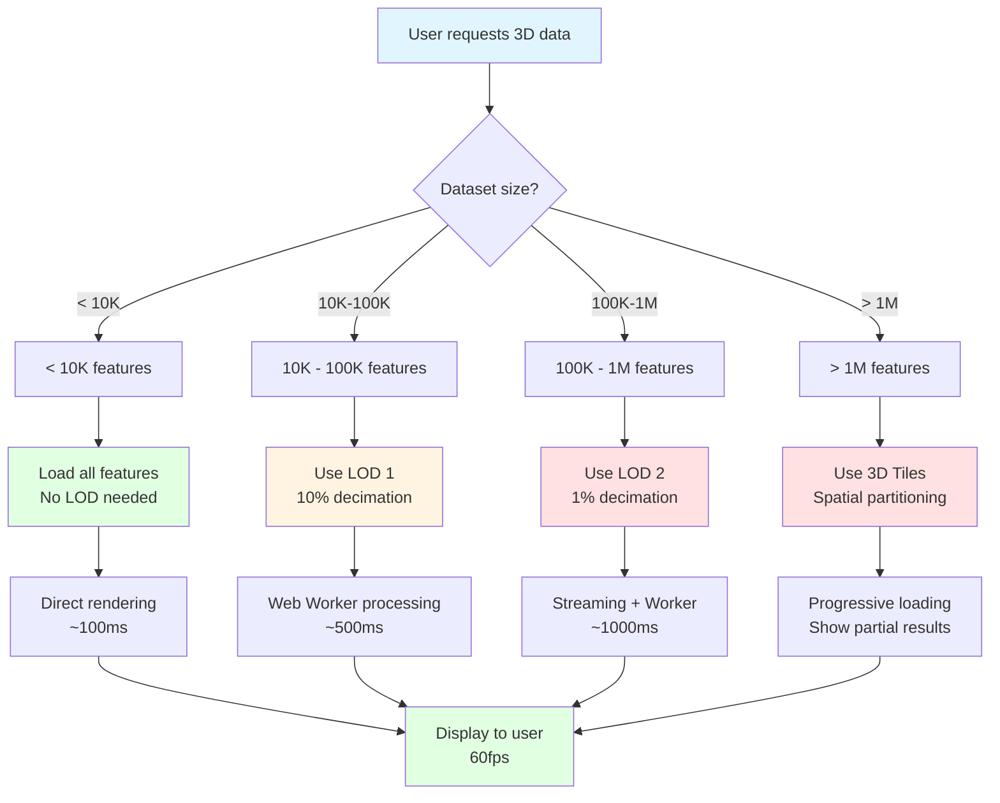

### Progressive Enhancement

```mermaid
graph LR
    subgraph "Basic Support"
        B1[2D Map<br/>MapLibre GL]
        B2[Vector Tiles<br/>Standard rendering]
        B3[Raster overlays<br/>Orthophotos]
    end

    subgraph "3D Support"
        D1[3D Terrain<br/>MapLibre terrain layer]
        D2[Extrusion<br/>Building heights]
        D3[Pitch/Bearing<br/>Camera controls]
    end

    subgraph "Advanced 3D"
        A1[Deck.gl layers<br/>Point clouds]
        A2[3D Geometries<br/>Z coordinates]
        A3[Real-time rendering<br/>1M+ features]
    end

    subgraph "VR/AR"
        V1[WebXR support<br/>Meta Quest]
        V2[Spatial anchoring<br/>GPS integration]
        V3[Immersive mode<br/>Field work]
    end

    B1 --> B2 --> B3
    B3 --> D1
    D1 --> D2 --> D3
    D3 --> A1
    A1 --> A2 --> A3
    A3 --> V1
    V1 --> V2 --> V3

    style B1 fill:#e1ffe1
    style D1 fill:#e1f5ff
    style A1 fill:#fff4e1
    style V1 fill:#ffe1e1
```

---

## Summary

All diagrams are created using Mermaid syntax and will render beautifully on GitHub, in VS Code with the Mermaid extension, or any markdown viewer that supports Mermaid.

### Quick Reference

| Diagram | Purpose | Key Insight |
|---------|---------|-------------|
| Client 3D Architecture | Overall system design | MapLibre + Deck.gl stack |
| Blazor Interop | Performance optimization | 225x faster with proper pattern |
| Drone Pipeline | Data processing workflow | Capture to visualization in hours |
| Meta Quest | VR/AR integration | WebXR-first approach, 50-70% time savings |
| 3D Geometry Stack | Data flow | Server → Network → Client → GPU |
| Point Cloud Rendering | High-performance display | 60fps with millions of points |
| Performance Flow | Optimization strategy | Progressive enhancement |

### Rendering Tips

To view these diagrams:

1. **GitHub:** Automatically renders Mermaid
2. **VS Code:** Install "Markdown Preview Mermaid Support" extension
3. **Online:** Use [Mermaid Live Editor](https://mermaid.live)
4. **Export:** Use `mmdc` CLI to export as PNG/SVG

```bash
# Install mermaid CLI
npm install -g @mermaid-js/mermaid-cli

# Export diagram
mmdc -i ARCHITECTURE_DIAGRAMS.md -o diagrams.png
```
