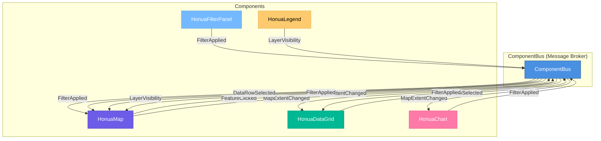

# Honua.MapSDK

> **Next-Generation Mapping Components for Blazor**
> Build powerful, interactive geospatial dashboards with minimal code.

[](https://www.nuget.org/packages/Honua.MapSDK/)
[](LICENSE.md)

---

## What is Honua.MapSDK?

Honua.MapSDK is a comprehensive suite of Blazor components designed to make building geospatial applications simple and powerful. Built on **MapLibre GL JS** and **MudBlazor**, it provides everything you need to create interactive maps, visualize data, and build professional dashboards—all with automatic synchronization and minimal configuration.

### Key Features

- **🗺️ Interactive Maps** - Powered by MapLibre GL JS with full GPU acceleration
- **🔄 Auto-Sync Components** - Data grids, charts, and filters automatically synchronize
- **📊 Rich Visualizations** - Built-in charts, legends, and data grids
- **🎯 Advanced Filtering** - Spatial, attribute, and temporal filters out of the box
- **⚡ High Performance** - Handle millions of features with ease
- **🎨 Fully Customizable** - Theme support and extensive styling options
- **🔌 Pub/Sub Architecture** - Loosely coupled components via ComponentBus
- **📱 Responsive Design** - Works seamlessly on desktop and mobile

---

## Quick Start

Get started in 3 simple steps:

### 1. Install the Package

```bash
dotnet add package Honua.MapSDK
```

### 2. Configure Services

Add MapSDK to your `Program.cs`:

```csharp
builder.Services.AddHonuaMapSDK();
```

### 3. Build Your First Dashboard

```razor
@page "/dashboard"
@using Honua.MapSDK.Components

<MudContainer MaxWidth="MaxWidth.False" Class="pa-0">
    <MudGrid Spacing="0" Style="height: 100vh;">
        <!-- Map Component -->
        <MudItem xs="12" md="8" Style="height: 100%;">
            <HonuaMap Id="map1"
                      Center="@(new[] { -122.4, 37.7 })"
                      Zoom="12"
                      MapStyle="https://demotiles.maplibre.org/style.json" />
        </MudItem>

        <!-- Synchronized Components -->
        <MudItem xs="12" md="4" Style="height: 100%; overflow-y: auto;">
            <!-- Data Grid - Auto-syncs with map -->
            <HonuaDataGrid TItem="Feature"
                           Source="api/parcels.geojson"
                           SyncWith="map1"
                           Title="Parcels" />

            <!-- Chart - Auto-syncs with map extent -->
            <HonuaChart Type="ChartType.Histogram"
                        Field="value"
                        SyncWith="map1"
                        Title="Property Values" />

            <!-- Filter Panel - Filters map and all synced components -->
            <HonuaFilterPanel SyncWith="map1"
                              ShowSpatial="true"
                              ShowAttribute="true" />
        </MudItem>
    </MudGrid>
</MudContainer>
```

**That's it!** All components automatically synchronize through the ComponentBus. No manual wiring needed.

[📖 See the full Quick Start guide →](getting-started/quick-start.md)

---

## Component Gallery

### HonuaMap
The core interactive map component powered by MapLibre GL JS.

```razor
<HonuaMap Id="map1"
          Center="@(new[] { -118.2437, 34.0522 })"
          Zoom="10"
          Pitch="45"
          EnableGPU="true" />
```

**Features:**
- Multiple basemap styles
- Vector and raster tile support
- 3D terrain and buildings
- GPU-accelerated rendering
- Responsive and touch-enabled

[📖 HonuaMap Documentation →](components/honua-map.md)

---

### HonuaDataGrid
A powerful data grid that synchronizes with the map and other components.

```razor
<HonuaDataGrid TItem="PropertyData"
               Source="api/properties.geojson"
               SyncWith="map1"
               ShowSearch="true"
               ShowExport="true"
               Filterable="true"
               Sortable="true" />
```

**Features:**
- Auto-sync with map extent
- Click to highlight on map
- Export to JSON, CSV, GeoJSON
- Built-in search and filtering
- Pagination and sorting
- Custom column templates

[📖 HonuaDataGrid Documentation →](components/honua-datagrid.md)

---

### HonuaChart
Interactive charts with click-to-filter functionality.

```razor
<HonuaChart Type="ChartType.Bar"
            Field="category"
            Aggregation="AggregationType.Count"
            SyncWith="map1"
            EnableFilter="true"
            ColorScheme="cool" />
```

**Chart Types:**
- Histogram
- Bar
- Pie / Doughnut
- Line (time-series)

**Features:**
- Auto-update from map extent
- Click segments to filter
- Multiple aggregations (Count, Sum, Avg, Min, Max)
- Export as image
- Responsive and themeable

[📖 HonuaChart Documentation →](components/honua-chart.md)

---

### HonuaLegend
A dynamic legend that automatically updates as layers are added or modified.

```razor
<HonuaLegend SyncWith="map1"
             Position="top-right"
             Collapsible="true"
             ShowOpacity="true"
             ShowGroups="true" />
```

**Features:**
- Auto-discovers map layers
- Group layers by category
- Toggle visibility
- Adjust opacity with sliders
- Drag to reorder (coming soon)
- Customizable symbols

[📖 HonuaLegend Documentation →](components/honua-legend.md)

---

### HonuaFilterPanel
Advanced filtering UI for spatial, attribute, and temporal queries.

```razor
<HonuaFilterPanel SyncWith="map1"
                  ShowSpatial="true"
                  ShowAttribute="true"
                  ShowTemporal="true"
                  Title="Filter Data" />
```

**Filter Types:**
- **Spatial**: Bounding box, circle, polygon, distance
- **Attribute**: Equals, contains, ranges, in list
- **Temporal**: Before/after, between dates, relative (last N days)

**Features:**
- Real-time filtering
- Multiple active filters
- Filter persistence
- Custom field configurations

[📖 HonuaFilterPanel Documentation →](components/honua-filterpanel.md)

---

## Architecture

Honua.MapSDK is built on a **pub/sub architecture** using the ComponentBus, enabling loosely coupled, highly composable components.



### How It Works

1. **Components never reference each other directly**
2. **All communication happens through messages**
3. **Subscribe to relevant message types**
4. **Publish messages when state changes**
5. **Components remain independent and testable**

[📖 Learn more about ComponentBus →](concepts/component-bus.md)

---

## Why Choose Honua.MapSDK?

### Compared to Plain MapLibre

| Feature | Plain MapLibre | Honua.MapSDK |
|---------|---------------|--------------|
| **Setup Time** | Hours of JS interop | Minutes |
| **Component Sync** | Manual event wiring | Automatic |
| **Data Grids** | Build from scratch | Built-in |
| **Charts** | Integrate Chart.js manually | Built-in |
| **Filters** | Custom UI + logic | Built-in |
| **Type Safety** | JavaScript only | Full C# types |
| **Testing** | Complex | Simple |

### Compared to Other Frameworks

**Blazor-First Design**: Unlike JavaScript mapping libraries wrapped for Blazor, MapSDK is designed from the ground up for Blazor developers.

**No JavaScript Required**: Build complete mapping applications in 100% C#.

**Modern Stack**: Built on the latest Blazor, MudBlazor, and MapLibre technologies.

[📖 Migration Guides →](migration/)

---

## Real-World Use Cases

### Property Management Dashboard
Track and manage real estate portfolios with maps, analytics, and reporting.

```razor
<HonuaMap Source="api/properties" />
<HonuaDataGrid TItem="Property" SyncWith="map1" />
<HonuaChart Field="status" Type="Pie" />
<HonuaFilterPanel ShowAttribute="true" />
```

[📖 Full Tutorial →](tutorials/property-dashboard.md)

---

### IoT Sensor Monitoring
Monitor sensor networks in real-time with time-series data and alerting.

```razor
<HonuaMap Source="api/sensors" />
<HonuaTimeline DateField="timestamp" SyncWith="map1" />
<HonuaChart Type="Line" Field="temperature" TimeField="timestamp" />
```

[📖 Full Tutorial →](tutorials/sensor-monitoring.md)

---

### Fleet Tracking System
Track vehicle locations, routes, and status with live updates.

```razor
<HonuaMap Source="api/vehicles/realtime" />
<HonuaDataGrid TItem="Vehicle" SyncWith="map1" />
<HonuaChart Field="status" Type="Doughnut" />
```

[📖 Full Tutorial →](tutorials/fleet-tracking.md)

---

## Documentation

### Getting Started
- [Installation](getting-started/installation.md) - Set up your environment
- [Quick Start](getting-started/quick-start.md) - Build your first app
- [Your First Map](getting-started/first-map.md) - Detailed map walkthrough
- [Your First Dashboard](getting-started/your-first-dashboard.md) - Build a complete dashboard
- [Deployment](getting-started/deployment.md) - Deploy to production

### Components
- [Overview](components/overview.md) - All components at a glance
- [HonuaMap](components/honua-map.md) - Interactive map
- [HonuaDataGrid](components/honua-datagrid.md) - Data table
- [HonuaChart](components/honua-chart.md) - Charts and visualizations
- [HonuaLegend](components/honua-legend.md) - Map legend
- [HonuaFilterPanel](components/honua-filterpanel.md) - Advanced filtering

### Core Concepts
- [ComponentBus](concepts/component-bus.md) - Pub/sub messaging
- [Auto-Sync](concepts/auto-sync.md) - Automatic synchronization
- [Data Sources](concepts/data-sources.md) - Loading and managing data
- [Filtering](concepts/filtering.md) - Filter expressions and logic
- [Styling](concepts/styling.md) - Theming and customization
- [Performance](concepts/performance.md) - Optimization techniques

### Guides
- [Building Dashboards](guides/building-dashboards.md) - Dashboard patterns
- [Working with Data](guides/working-with-data.md) - Data handling
- [Custom Styling](guides/custom-styling.md) - Advanced theming
- [Advanced Filtering](guides/advanced-filtering.md) - Complex filters
- [Time-Series Data](guides/time-series-data.md) - Temporal data
- [Geocoding](guides/geocoding.md) - Address search
- [Export & Import](guides/export-import.md) - Data export/import

### API Reference
- [Component Parameters](api/component-parameters.md) - All parameters
- [Component Methods](api/component-methods.md) - Public APIs
- [ComponentBus Messages](api/componentbus-messages.md) - Message types
- [Filter Definitions](api/filter-definitions.md) - Filter API
- [Services](api/services.md) - Available services

### Recipes
- [Common Patterns](recipes/common-patterns.md) - Reusable patterns
- [Troubleshooting](recipes/troubleshooting.md) - Common issues
- [Performance Tips](recipes/performance-tips.md) - Optimization
- [Best Practices](recipes/best-practices.md) - Recommendations

### Migration
- [From MapLibre](migration/from-maplibre.md) - Migrate from MapLibre
- [From Leaflet](migration/from-leaflet.md) - Migrate from Leaflet
- [From OpenLayers](migration/from-openlayers.md) - Migrate from OpenLayers

---

## Requirements

- **.NET 8.0** or higher
- **Blazor Server** or **Blazor WebAssembly**
- **MudBlazor 6.0+** (automatically installed)

---

## Installation

Install via NuGet Package Manager:

```bash
dotnet add package Honua.MapSDK
```

Or via Package Manager Console:

```powershell
Install-Package Honua.MapSDK
```

[📖 Detailed Installation Guide →](getting-started/installation.md)

---

## Contributing

We welcome contributions! Whether it's bug reports, feature requests, or pull requests, your input helps make MapSDK better.

- [Contributing Guidelines](CONTRIBUTING.md)
- [Code of Conduct](CODE_OF_CONDUCT.md)
- [Issue Tracker](https://github.com/honua-io/Honua.Server/issues)

---

## Support

- **Documentation**: You're reading it!
- **GitHub Issues**: [Report bugs or request features](https://github.com/honua-io/Honua.Server/issues)
- **Discussions**: [Ask questions and share ideas](https://github.com/honua-io/Honua.Server/discussions)

---

## License

Honua.MapSDK is licensed under the [MIT License](LICENSE.md).

---

## Credits

Built with:
- [MapLibre GL JS](https://maplibre.org/) - Modern mapping library
- [MudBlazor](https://mudblazor.com/) - Material Design for Blazor
- [Chart.js](https://www.chartjs.org/) - JavaScript charting library

---

## What's Next?

Ready to build amazing mapping applications?

1. [📦 Install the package](getting-started/installation.md)
2. [🚀 Follow the Quick Start](getting-started/quick-start.md)
3. [📚 Explore the tutorials](tutorials/)
4. [🎨 Customize your dashboard](guides/building-dashboards.md)

**Happy Mapping!**

---

<div align="center">
  <p>Made with ❤️ by the Honua team</p>
  <p>
    <a href="https://github.com/honua-io/Honua.Server">GitHub</a> •
    <a href="https://www.nuget.org/packages/Honua.MapSDK">NuGet</a> •
    <a href="getting-started/installation.md">Docs</a>
  </p>
</div>
