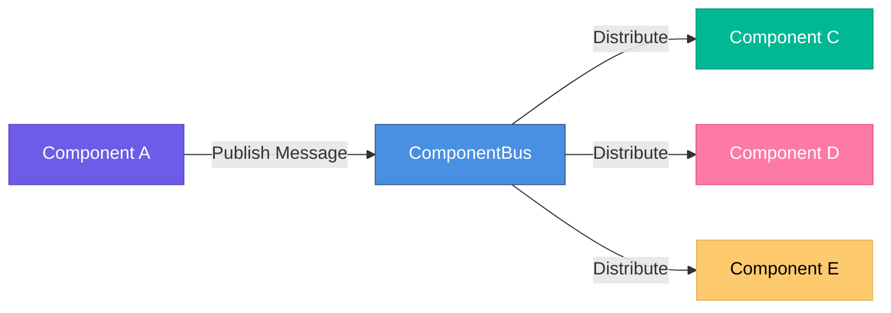

# Components Overview

Honua.MapSDK provides a comprehensive suite of Blazor components for building geospatial applications. All components are designed to work together seamlessly through the ComponentBus.

---

## Core Components

### HonuaMap
**Interactive mapping powered by MapLibre GL JS**

The foundation of your geospatial application. Supports vector and raster tiles, 3D views, GPU acceleration, and custom styling.

```razor
<HonuaMap Id="map1"
          Center="@(new[] { -122.4, 37.7 })"
          Zoom="12" />
```

[📖 Full Documentation →](honua-map.md)

**Key Features:**
- Vector and raster tile support
- 3D terrain and buildings
- GPU-accelerated rendering
- Multiple projections
- Touch and gesture support

---

### HonuaDataGrid
**Powerful data grid with map synchronization**

Display tabular data with built-in search, filtering, sorting, and export capabilities. Automatically synchronizes with map extent and selection.

```razor
<HonuaDataGrid TItem="Feature"
               Items="@_data"
               SyncWith="map1"
               ShowSearch="true"
               ShowExport="true" />
```

[📖 Full Documentation →](honua-datagrid.md)

**Key Features:**
- Auto-sync with map extent
- Click to highlight on map
- Export to JSON, CSV, GeoJSON
- Built-in search and filtering
- Pagination and sorting
- Custom column templates

---

### HonuaChart
**Interactive charts and visualizations**

Visualize your data with multiple chart types. Charts automatically update based on map extent and support click-to-filter interactions.

```razor
<HonuaChart Type="ChartType.Bar"
            Field="category"
            SyncWith="map1"
            EnableFilter="true" />
```

[📖 Full Documentation →](honua-chart.md)

**Key Features:**
- Multiple chart types (Bar, Pie, Histogram, Line)
- Auto-sync with map extent
- Click segments to filter
- Multiple aggregations
- Export as image
- Responsive and themeable

---

### HonuaLegend
**Dynamic map legend**

Automatically displays and manages map layers with visibility toggles, opacity controls, and grouping.

```razor
<HonuaLegend SyncWith="map1"
             Position="top-right"
             Collapsible="true"
             ShowOpacity="true" />
```

[📖 Full Documentation →](honua-legend.md)

**Key Features:**
- Auto-discovers map layers
- Group layers by category
- Toggle visibility
- Adjust opacity
- Customizable symbols
- Floating or embedded

---

### HonuaFilterPanel
**Advanced filtering UI**

Provides spatial, attribute, and temporal filtering capabilities with an intuitive interface.

```razor
<HonuaFilterPanel SyncWith="map1"
                  ShowSpatial="true"
                  ShowAttribute="true"
                  ShowTemporal="true" />
```

[📖 Full Documentation →](honua-filterpanel.md)

**Key Features:**
- Spatial filters (bounds, circle, polygon)
- Attribute filters (equals, contains, ranges)
- Temporal filters (dates, relative periods)
- Real-time filtering
- Multiple active filters
- Custom field configurations

---

## Component Communication

All components communicate through the **ComponentBus**, a pub/sub message broker that enables loosely coupled interactions.

### How It Works



### Example: Click Flow

1. User clicks feature on **HonuaMap**
2. Map publishes `FeatureClickedMessage`
3. **HonuaDataGrid** receives message and scrolls to row
4. **HonuaChart** receives message and highlights segment
5. **HonuaLegend** receives message and updates selection

**No manual wiring required!**

[📖 Learn more about ComponentBus →](../concepts/component-bus.md)

---

## Auto-Sync with SyncWith

The `SyncWith` parameter enables automatic synchronization between components.

### Example

```razor
<!-- Master map -->
<HonuaMap Id="main-map" />

<!-- All these components sync with the map -->
<HonuaDataGrid SyncWith="main-map" />
<HonuaChart SyncWith="main-map" />
<HonuaLegend SyncWith="main-map" />
<HonuaFilterPanel SyncWith="main-map" />
```

### What Gets Synchronized?

| Trigger | Effect |
|---------|--------|
| **Map extent changes** | Data grid and chart update to show visible features |
| **Data grid row selected** | Map highlights feature |
| **Chart segment clicked** | Map and data grid filter to category |
| **Filter applied** | All components update to show filtered data |
| **Layer visibility changed** | Map updates layer visibility |

[📖 Learn more about Auto-Sync →](../concepts/auto-sync.md)

---

## Styling Components

### Theme Support

All components respect MudBlazor theme settings:

```razor
<MudThemeProvider Theme="@_theme" />

@code {
    private MudTheme _theme = new MudTheme
    {
        Palette = new PaletteLight
        {
            Primary = "#4A90E2",
            Secondary = "#6C5CE7",
            // ... more colors
        }
    };
}
```

### Custom CSS Classes

Every component supports custom CSS:

```razor
<HonuaMap CssClass="my-custom-map" />
<HonuaDataGrid CssClass="my-custom-grid" />
<HonuaChart CssClass="my-custom-chart" />
```

### Inline Styles

Or use inline styles:

```razor
<HonuaMap Style="border: 2px solid #ccc; border-radius: 8px;" />
```

[📖 Learn more about Styling →](../concepts/styling.md)

---

## Component Lifecycle

### Initialization Order

1. **OnInitialized** - Component created
2. **OnParametersSet** - Parameters received
3. **OnAfterRenderAsync (firstRender=true)** - DOM ready
4. **Component initializes MapLibre/Chart.js** - JavaScript interop
5. **ComponentBus subscriptions setup** - Start listening for messages
6. **OnMapReady/OnChartReady** - Component ready for use

### Best Practices

```razor
@code {
    private HonuaMap? _map;

    protected override void OnInitialized()
    {
        // Subscribe to ComponentBus messages
        SetupSubscriptions();
    }

    protected override async Task OnAfterRenderAsync(bool firstRender)
    {
        if (firstRender)
        {
            // Initialize data after first render
            await LoadInitialData();
        }
    }

    private async Task LoadInitialData()
    {
        // Safe to call map methods after OnAfterRenderAsync
        if (_map != null)
        {
            await _map.FlyToAsync(new[] { -122.4, 37.7 }, 12);
        }
    }
}
```

---

## Common Patterns

### Master-Detail View

```razor
<MudGrid>
    <MudItem xs="8">
        <HonuaMap Id="map1" OnFeatureClicked="@ShowDetails" />
    </MudItem>
    <MudItem xs="4">
        @if (_selectedFeature != null)
        {
            <MudPaper Class="pa-4">
                <MudText Typo="Typo.h6">@_selectedFeature.Name</MudText>
                <MudText>@_selectedFeature.Description</MudText>
            </MudPaper>
        }
    </MudItem>
</MudGrid>

@code {
    private Feature? _selectedFeature;

    private void ShowDetails(FeatureClickedMessage msg)
    {
        _selectedFeature = GetFeatureById(msg.FeatureId);
    }
}
```

### Multi-Map Dashboard

```razor
<MudGrid>
    <MudItem xs="6">
        <HonuaMap Id="map-overview" Zoom="5" />
        <HonuaDataGrid SyncWith="map-overview" Title="Overview" />
    </MudItem>
    <MudItem xs="6">
        <HonuaMap Id="map-detail" Zoom="15" />
        <HonuaDataGrid SyncWith="map-detail" Title="Details" />
    </MudItem>
</MudGrid>
```

### Conditional Loading

```razor
@if (_dataLoaded)
{
    <HonuaMap Id="map1" Source="@_dataSource" />
    <HonuaDataGrid Items="@_features" SyncWith="map1" />
}
else
{
    <MudProgressCircular Indeterminate="true" />
}

@code {
    private bool _dataLoaded = false;
    private string? _dataSource;
    private List<Feature> _features = new();

    protected override async Task OnInitializedAsync()
    {
        await LoadData();
        _dataLoaded = true;
    }
}
```

---

## Component Comparison

| Component | Primary Use | Data Visualization | User Interaction | Auto-Sync |
|-----------|-------------|-------------------|------------------|-----------|
| **HonuaMap** | Geospatial display | ✅ High | ✅ High | ✅ Yes |
| **HonuaDataGrid** | Tabular display | ✅ Medium | ✅ High | ✅ Yes |
| **HonuaChart** | Statistical visualization | ✅ High | ✅ Medium | ✅ Yes |
| **HonuaLegend** | Layer management | ❌ No | ✅ Medium | ✅ Yes |
| **HonuaFilterPanel** | Data filtering | ❌ No | ✅ High | ✅ Yes |

---

## Future Components

The following components are planned for future releases:

### HonuaSearch
**Location and feature search**
- Geocoding integration
- Feature search
- Auto-complete
- Search history

### HonuaTimeline
**Temporal data visualization**
- Time slider
- Animation playback
- Time range selection
- Speed controls

### HonuaBasemapPicker
**Basemap selection**
- Thumbnail previews
- Quick switching
- Custom basemaps

### HonuaMeasure
**Measurement tools**
- Distance measurement
- Area calculation
- Bearing/azimuth

### HonuaPrint
**Map printing and export**
- Print layouts
- PDF export
- Image export
- Custom templates

---

## Component Bundles

For common scenarios, consider these component combinations:

### Property Dashboard
```razor
<HonuaMap />
<HonuaDataGrid />
<HonuaChart Type="Bar" />
<HonuaFilterPanel ShowAttribute="true" />
```

### Sensor Monitoring
```razor
<HonuaMap />
<HonuaTimeline />  @* Coming soon *@
<HonuaChart Type="Line" />
<HonuaDataGrid Dense="true" />
```

### Fleet Tracking
```razor
<HonuaMap />
<HonuaDataGrid />
<HonuaChart Type="Doughnut" />
<HonuaLegend />
```

---

## Next Steps

- [HonuaMap Documentation](honua-map.md)
- [HonuaDataGrid Documentation](honua-datagrid.md)
- [HonuaChart Documentation](honua-chart.md)
- [HonuaLegend Documentation](honua-legend.md)
- [HonuaFilterPanel Documentation](honua-filterpanel.md)
- [ComponentBus Concepts](../concepts/component-bus.md)
- [Building Dashboards Guide](../guides/building-dashboards.md)

---

## Getting Help

- [API Reference](../api/component-parameters.md)
- [Common Patterns](../recipes/common-patterns.md)
- [Troubleshooting](../recipes/troubleshooting.md)
- [GitHub Discussions](https://github.com/honua-io/Honua.Server/discussions)
