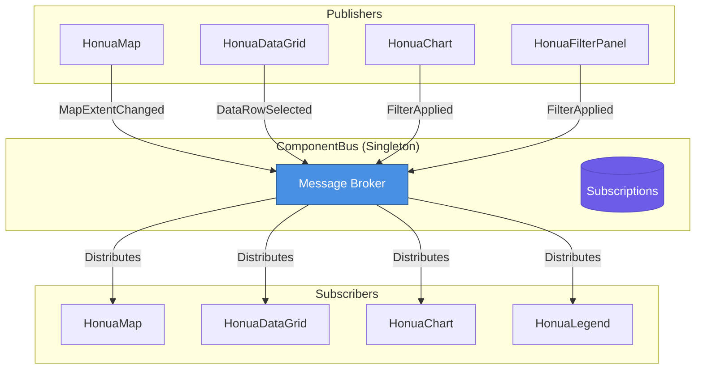

# ComponentBus

The ComponentBus is the heart of Honua.MapSDK's architecture, enabling loosely coupled communication between components through a publish/subscribe (pub/sub) pattern.

---

## Overview

Traditional component communication requires tight coupling—components must reference each other directly. ComponentBus eliminates this by acting as a message broker where components:

1. **Publish** messages when their state changes
2. **Subscribe** to message types they care about
3. **Never reference each other directly**

This creates a flexible, maintainable architecture where components can be added, removed, or replaced without breaking the application.

---

## Architecture



---

## How It Works

### 1. Dependency Injection

ComponentBus is registered as a singleton service:

```csharp
// In Program.cs (automatically done by AddHonuaMapSDK)
builder.Services.AddSingleton<ComponentBus>();
```

### 2. Components Subscribe

Components subscribe to message types they're interested in:

```csharp
@inject ComponentBus Bus

@code {
    protected override void OnInitialized()
    {
        // Subscribe to map extent changes
        Bus.Subscribe<MapExtentChangedMessage>(args =>
        {
            Console.WriteLine($"Map moved to: {args.Message.Center[0]}, {args.Message.Center[1]}");
            Console.WriteLine($"Source: {args.Source}");
            Console.WriteLine($"Timestamp: {args.Timestamp}");

            // Update component state
            UpdateForNewExtent(args.Message.Bounds);
        });
    }
}
```

### 3. Components Publish

When state changes, components publish messages:

```csharp
// When user pans the map
await Bus.PublishAsync(new MapExtentChangedMessage
{
    MapId = "map1",
    Center = new[] { -122.4, 37.7 },
    Zoom = 12,
    Bounds = new[] { -122.5, 37.7, -122.3, 37.8 }
}, source: "map1");
```

### 4. Subscribers Receive

All subscribed components receive the message:

```csharp
// In HonuaDataGrid
Bus.Subscribe<MapExtentChangedMessage>(args =>
{
    if (args.Message.MapId == SyncWith)
    {
        // Filter data to visible extent
        FilterDataByBounds(args.Message.Bounds);
    }
});

// In HonuaChart
Bus.Subscribe<MapExtentChangedMessage>(args =>
{
    if (args.Message.MapId == SyncWith)
    {
        // Update chart for visible features
        UpdateChart(args.Message.Bounds);
    }
});
```

---

## Message Types

### Map Messages

#### MapReadyMessage
Published when a map finishes initializing.

```csharp
public class MapReadyMessage
{
    public required string MapId { get; init; }
    public required double[] Center { get; init; }
    public required double Zoom { get; init; }
}
```

**Usage:**
```csharp
Bus.Subscribe<MapReadyMessage>(args =>
{
    Console.WriteLine($"Map {args.Message.MapId} is ready");
    LoadInitialData();
});
```

#### MapExtentChangedMessage
Published when map viewport changes (pan, zoom, rotate).

```csharp
public class MapExtentChangedMessage
{
    public required string MapId { get; init; }
    public required double[] Bounds { get; init; }  // [west, south, east, north]
    public required double Zoom { get; init; }
    public required double[] Center { get; init; }
    public double Bearing { get; init; }
    public double Pitch { get; init; }
}
```

**Usage:**
```csharp
Bus.Subscribe<MapExtentChangedMessage>(args =>
{
    FilterFeaturesByBounds(args.Message.Bounds);
});
```

#### FeatureClickedMessage
Published when user clicks a feature on the map.

```csharp
public class FeatureClickedMessage
{
    public required string MapId { get; init; }
    public required string LayerId { get; init; }
    public required string FeatureId { get; init; }
    public Dictionary<string, object> Properties { get; init; } = new();
    public object? Geometry { get; init; }
}
```

**Usage:**
```csharp
Bus.Subscribe<FeatureClickedMessage>(args =>
{
    ShowFeatureDetails(args.Message.Properties);
});
```

#### FeatureHoveredMessage
Published when user hovers over a feature.

```csharp
public class FeatureHoveredMessage
{
    public required string MapId { get; init; }
    public string? FeatureId { get; init; }  // null when hover ends
    public string? LayerId { get; init; }
    public Dictionary<string, object>? Properties { get; init; }
}
```

---

### Filter Messages

#### FilterAppliedMessage
Published when a filter is applied.

```csharp
public class FilterAppliedMessage
{
    public required string FilterId { get; init; }
    public required FilterType Type { get; init; }  // Spatial, Attribute, Temporal
    public required object Expression { get; init; }
    public string[]? AffectedLayers { get; init; }
}
```

**Usage:**
```csharp
Bus.Subscribe<FilterAppliedMessage>(args =>
{
    ApplyFilterToMap(args.Message.Expression);
    UpdateDataGrid(args.Message.Expression);
});
```

#### FilterClearedMessage
Published when a specific filter is removed.

```csharp
public class FilterClearedMessage
{
    public required string FilterId { get; init; }
}
```

#### AllFiltersClearedMessage
Published when all filters are cleared.

```csharp
public class AllFiltersClearedMessage
{
    public required string Source { get; init; }
}
```

---

### Data Messages

#### DataRowSelectedMessage
Published when a row is selected in a data grid.

```csharp
public class DataRowSelectedMessage
{
    public required string GridId { get; init; }
    public required string RowId { get; init; }
    public Dictionary<string, object> Data { get; init; } = new();
    public object? Geometry { get; init; }
}
```

**Usage:**
```csharp
Bus.Subscribe<DataRowSelectedMessage>(args =>
{
    HighlightFeatureOnMap(args.Message.RowId, args.Message.Geometry);
});
```

#### DataLoadedMessage
Published when data is loaded into a component.

```csharp
public class DataLoadedMessage
{
    public required string ComponentId { get; init; }
    public required int FeatureCount { get; init; }
    public required string Source { get; init; }
}
```

---

### Layer Messages

#### LayerVisibilityChangedMessage
Published when layer visibility changes.

```csharp
public class LayerVisibilityChangedMessage
{
    public required string LayerId { get; init; }
    public required bool Visible { get; init; }
}
```

#### LayerOpacityChangedMessage
Published when layer opacity changes.

```csharp
public class LayerOpacityChangedMessage
{
    public required string LayerId { get; init; }
    public required double Opacity { get; init; }  // 0.0 to 1.0
}
```

---

### Request Messages

#### FlyToRequestMessage
Request to animate map to a location.

```csharp
public class FlyToRequestMessage
{
    public required string MapId { get; init; }
    public required double[] Center { get; init; }
    public double? Zoom { get; init; }
    public double? Bearing { get; init; }
    public double? Pitch { get; init; }
    public int Duration { get; init; } = 1000;  // milliseconds
}
```

**Usage:**
```csharp
await Bus.PublishAsync(new FlyToRequestMessage
{
    MapId = "map1",
    Center = new[] { -122.4, 37.7 },
    Zoom = 15,
    Duration = 2000
}, "navigation-button");
```

#### FitBoundsRequestMessage
Request to fit map to specific bounds.

```csharp
public class FitBoundsRequestMessage
{
    public required string MapId { get; init; }
    public required double[] Bounds { get; init; }  // [west, south, east, north]
    public int Padding { get; init; } = 50;  // pixels
}
```

---

## Advanced Usage

### Async Handlers

Handlers can be asynchronous:

```csharp
Bus.Subscribe<MapExtentChangedMessage>(async args =>
{
    // Perform async operation
    var features = await LoadFeaturesForExtent(args.Message.Bounds);

    // Update state
    _visibleFeatures = features;
    await InvokeAsync(StateHasChanged);
});
```

### Filtering by Source

Ignore messages from specific sources:

```csharp
Bus.Subscribe<MapExtentChangedMessage>(args =>
{
    // Ignore messages from self
    if (args.Source == MyComponentId)
        return;

    UpdateForExtentChange(args.Message);
});
```

### Conditional Subscription

Subscribe only when needed:

```csharp
@code {
    private Action<MessageArgs<MapExtentChangedMessage>>? _handler;

    private void EnableSync()
    {
        _handler = args => UpdateForExtent(args.Message);
        Bus.Subscribe<MapExtentChangedMessage>(_handler);
    }

    private void DisableSync()
    {
        if (_handler != null)
        {
            Bus.Unsubscribe<MapExtentChangedMessage>(_handler);
            _handler = null;
        }
    }
}
```

### Message Metadata

Every message includes metadata:

```csharp
Bus.Subscribe<MapExtentChangedMessage>(args =>
{
    // Access metadata
    Console.WriteLine($"Source: {args.Source}");
    Console.WriteLine($"Timestamp: {args.Timestamp}");
    Console.WriteLine($"CorrelationId: {args.CorrelationId}");

    // Access actual message
    var message = args.Message;
});
```

---

## Best Practices

### 1. Subscribe in OnInitialized

```csharp
protected override void OnInitialized()
{
    SetupSubscriptions();
}

private void SetupSubscriptions()
{
    Bus.Subscribe<MapExtentChangedMessage>(HandleExtentChanged);
    Bus.Subscribe<FeatureClickedMessage>(HandleFeatureClick);
}
```

### 2. Use Typed Handlers

```csharp
private void HandleExtentChanged(MessageArgs<MapExtentChangedMessage> args)
{
    // Typed handler - better for testing and readability
    var bounds = args.Message.Bounds;
    UpdateData(bounds);
}
```

### 3. Always Use InvokeAsync for State Changes

```csharp
Bus.Subscribe<MapExtentChangedMessage>(async args =>
{
    _currentExtent = args.Message.Bounds;

    // Must use InvokeAsync when updating state
    await InvokeAsync(StateHasChanged);
});
```

### 4. Include Source Information

```csharp
await Bus.PublishAsync(new FilterAppliedMessage
{
    FilterId = "my-filter",
    Type = FilterType.Attribute,
    Expression = filterExpr
}, source: Id);  // Always provide source
```

### 5. Handle Errors Gracefully

```csharp
Bus.Subscribe<MapExtentChangedMessage>(async args =>
{
    try
    {
        await UpdateDataForExtent(args.Message.Bounds);
    }
    catch (Exception ex)
    {
        Logger.LogError(ex, "Error updating data for extent change");
        // Don't throw - let other subscribers continue
    }
});
```

---

## Testing with ComponentBus

### Unit Testing

```csharp
[Fact]
public async Task Component_PublishesMessage_WhenStateChanges()
{
    // Arrange
    var bus = new ComponentBus();
    var component = new MyComponent { Bus = bus };

    MapExtentChangedMessage? receivedMessage = null;
    bus.Subscribe<MapExtentChangedMessage>(args =>
    {
        receivedMessage = args.Message;
    });

    // Act
    await component.UpdateExtent(new[] { -122.4, 37.7 }, 12);

    // Assert
    Assert.NotNull(receivedMessage);
    Assert.Equal(12, receivedMessage.Zoom);
}
```

### Integration Testing

```csharp
[Fact]
public async Task Map_And_Grid_Sync_Correctly()
{
    // Arrange
    var bus = new ComponentBus();
    var map = new HonuaMap { Id = "map1", Bus = bus };
    var grid = new HonuaDataGrid { SyncWith = "map1", Bus = bus };

    // Act
    await map.ChangeExtent(new[] { -122.5, 37.7, -122.3, 37.8 });

    // Assert
    Assert.True(grid.DataWasFiltered);
}
```

---

## Debugging

### Enable Logging

```csharp
builder.Logging.AddFilter("Honua.MapSDK.Core.ComponentBus", LogLevel.Debug);
```

### Monitor Messages

```csharp
@inject ComponentBus Bus

@code {
    protected override void OnInitialized()
    {
        // Subscribe to all messages for debugging
        SubscribeToAll();
    }

    private void SubscribeToAll()
    {
        Bus.Subscribe<MapExtentChangedMessage>(args =>
            Console.WriteLine($"MapExtentChanged from {args.Source}"));

        Bus.Subscribe<FeatureClickedMessage>(args =>
            Console.WriteLine($"FeatureClicked: {args.Message.FeatureId}"));

        Bus.Subscribe<FilterAppliedMessage>(args =>
            Console.WriteLine($"FilterApplied: {args.Message.FilterId}"));
    }
}
```

### Check Subscriber Count

```csharp
var count = Bus.GetSubscriberCount<MapExtentChangedMessage>();
Console.WriteLine($"MapExtentChanged has {count} subscribers");
```

---

## Performance Considerations

### Message Frequency

High-frequency messages (like map extent changes during panning) are debounced internally.

### Handler Performance

Keep handlers fast:

```csharp
// Good - fast handler
Bus.Subscribe<MapExtentChangedMessage>(args =>
{
    _currentBounds = args.Message.Bounds;
    _needsUpdate = true;
});

// Bad - slow handler blocks other subscribers
Bus.Subscribe<MapExtentChangedMessage>(async args =>
{
    await Task.Delay(5000);  // DON'T DO THIS
    await HeavyOperation();  // DON'T DO THIS
});

// Better - offload heavy work
Bus.Subscribe<MapExtentChangedMessage>(args =>
{
    _ = Task.Run(async () =>
    {
        await HeavyOperation();
        await InvokeAsync(StateHasChanged);
    });
});
```

### Memory Management

Subscriptions are automatically cleaned up when components are disposed, but you can manually unsubscribe:

```csharp
@implements IDisposable

@code {
    private Action<MessageArgs<MapExtentChangedMessage>>? _handler;

    protected override void OnInitialized()
    {
        _handler = HandleExtentChanged;
        Bus.Subscribe<MapExtentChangedMessage>(_handler);
    }

    public void Dispose()
    {
        if (_handler != null)
        {
            Bus.Unsubscribe<MapExtentChangedMessage>(_handler);
        }
    }
}
```

---

## Custom Messages

Create your own message types:

```csharp
public class CustomAnalysisCompleteMessage
{
    public required string AnalysisId { get; init; }
    public required Dictionary<string, object> Results { get; init; }
    public DateTime CompletedAt { get; init; } = DateTime.UtcNow;
}

// Publish
await Bus.PublishAsync(new CustomAnalysisCompleteMessage
{
    AnalysisId = "analysis-1",
    Results = analysisResults
}, "analysis-service");

// Subscribe
Bus.Subscribe<CustomAnalysisCompleteMessage>(args =>
{
    ShowResults(args.Message.Results);
});
```

---

## Next Steps

- [Auto-Sync Concept](auto-sync.md)
- [ComponentBus Messages API](../api/componentbus-messages.md)
- [Component Documentation](../components/overview.md)
- [Building Custom Components](../tutorials/custom-component.md)

---

**The ComponentBus is what makes MapSDK components work together seamlessly. Understanding it is key to building powerful geospatial applications.**
